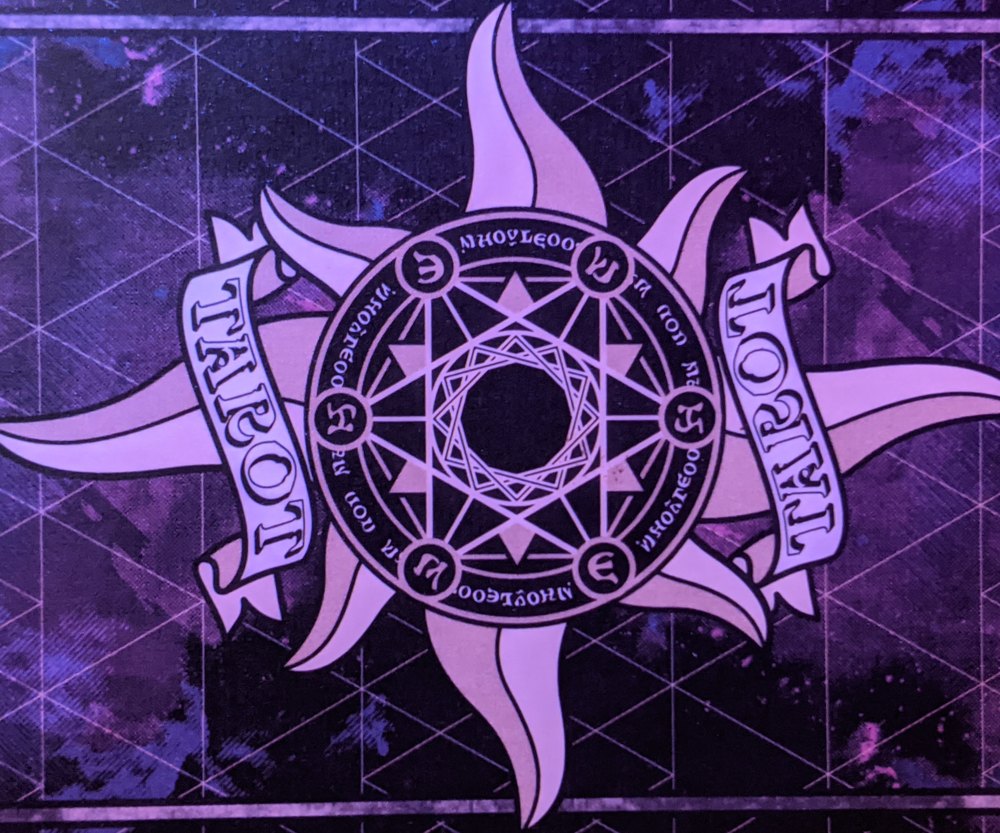
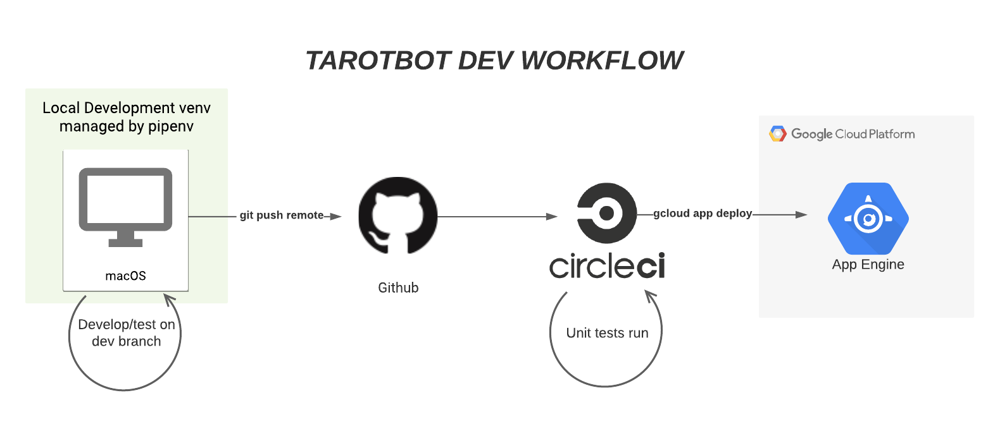
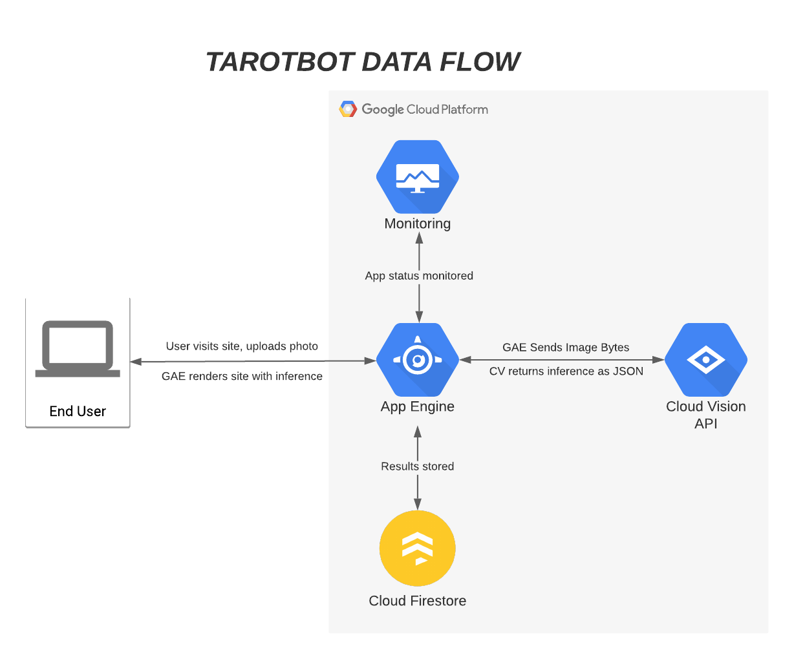

<!-- HEADER -->

  <h1 align="center">TarotBot-Flask App</h1>
  

     Final project for Northwestern University MSDS 434 - Analytics Application Engineering
  

***
## Table of Contents
* [Overview](#Overview)
* [Development Workflow](#DevelopmentWorkflow)
* [Information Flow](#InformationFlow)

***
## Overview
This project is a combination of object detection and image classification on a Google App Engine hosted website. In short, users can submit a photo of a Tarot card and the app will classify the card using a computer vision model, then store the results in Cloud Firestore.

#### Tools Used
* [Pipenv](https://pipenv.pypa.io/en/latest/): Pipenv was used to create a virtual development environment within a Unix shell running on my local macOS machine.
* [Flask](https://flask.palletsprojects.com/en/1.1.x/): Flask operates as the central point of data flow within the app -- it serves out an interactive website where users can submit a photo and see the results of the machine learning inference.
* [CircleCI](https://circleci.com/): CircleCI was used to incorporate continuous integration into the project. Anytime code was pushed to the main branch of the GitHub repository, CircleCI was triggered to build and test the newest version of the app before deploying to Google App Engine.
* [Google App Engine](https://cloud.google.com/appengine): GAE was used as the server to serve out the Flask app, which is a basic website that accepts user input of a photo, connects to the AutoML Vision API to get an inference, then stores said inference in Firestore. When users view the results page of the app, it retrieves past stored inferences from Firestore.
* [Google AutoML Vision](https://cloud.google.com/vision): This is the service that was used to train and evaluate the object detection and classification model, as well as deploy the completed model to the cloud so that the Flask app could connect to it via the Vision API client libraries.
* [Google Firestore](https://firebase.google.com/products/firestore): Firestore is used as a NoSQL database to store tarot inference results. The Flask app stores individual results to Firestore as they are returned, and also requests all existing inference results to display to the user.
* [Google Cloud Monitoring](https://cloud.google.com/monitoring): Cloud monitoring provides logging of any errors that may occur. Cloud monitoring was also used to set uptime checks, and send alerts in case the app was unreachable for more than one minute.

## Development Workflow

1. The app was developed on a macOS machine usine pipenv to create a virtual environment. A local development Git branch housed commits. Once features had been built and tested to satisfaction, the dev branch was merged with the main branch and pushed to GitHub.
2. This GitHub repo was connected via webhook to a CircleCI project. Upon any commits, CircleCI would checkout the repo, build and test the app, then (if passed unit tests), deploy to Google App Engine
3. Google App Engine served out the Flask app on a publicly-facing URL.

## Information Flow

Information flow within the app is fairly straightforward.
1. User accesses the root site URL.
2. User submits a photo via the form on the site.
3. Flask receives the photo then invokes the AutoML Vision client API to request an inference on the image.
4. Flask recieves the inference results, then invokes the Firestore client to store the results.
5. When user navigates to the results page, Flask will again invoke the Firestore client to retrieve all inference results and display them via HTML.

Read my [final report here](./assets/Christopher_Rico_MSDS434_Final.pdf)
